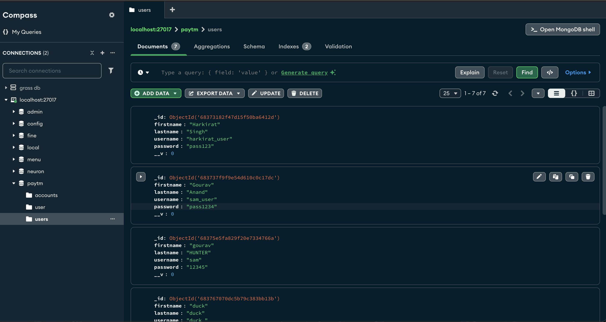
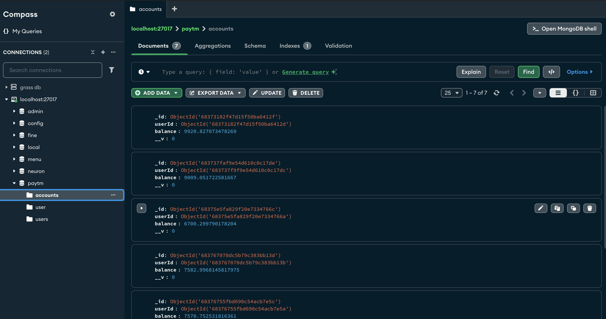
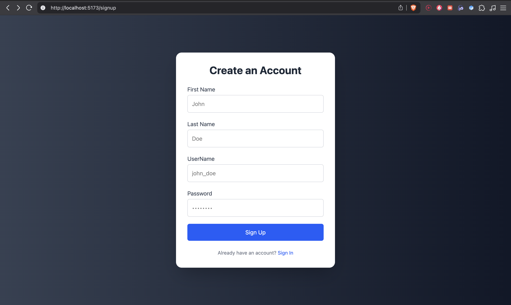
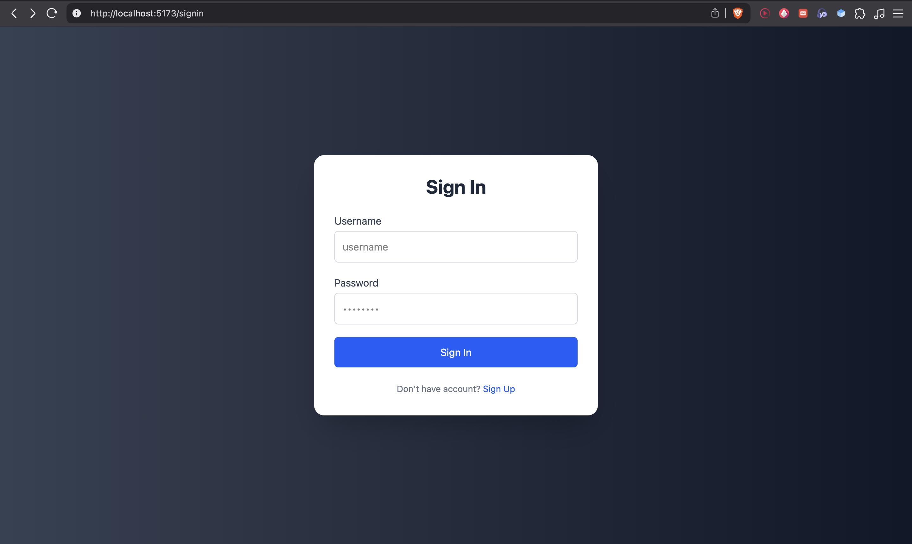
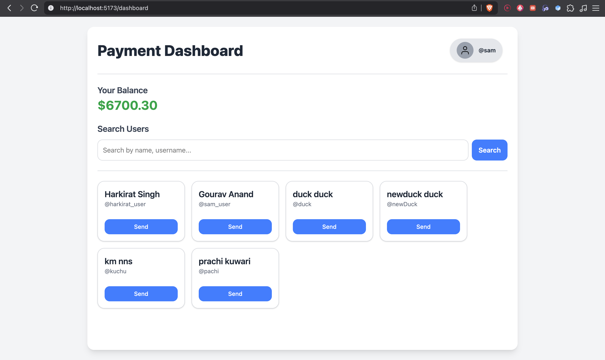

````md
# 💸 Paytm Clone

A simple full-stack Paytm clone with features like user authentication, wallet balance tracking, and money transfer.

---

### 1. Clone the Repo & Install

```bash
git clone https://github.com/venomusblood568/paytm-clone
cd paytm-clone
npm install
````

### 2. Create `.env` File

```env
PORT=3000
MONGO_URI=mongodb://localhost:27017/paytm-clone
JWT_SECRET=your_jwt_secret
```

### 3. Run the Backend

```bash
npm run dev
```


### 🖼️ Backend Output





---

## 🎨 Frontend

If you have a frontend, run it like this:

```bash
cd frontend
npm install
npm start
```

📸 UI Screenshots:






